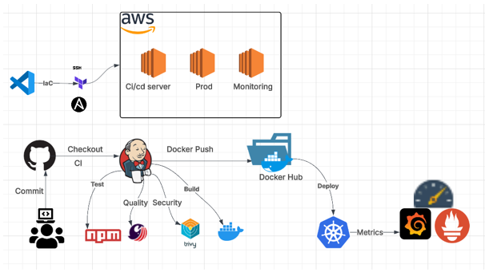

# Projet DevSecOps – Infrastructure AWS avec Terraform & Ansible

Ce dépôt contient uniquement la partie **Infrastructure as Code (IaC)** de mon projet DevSecOps. L'objectif est de provisionner automatiquement une infrastructure sur AWS à l’aide de Terraform, puis de configurer les machines via Ansible.

> Les autres composants du projet (CI/CD, application, supervision) sont disponibles dans un autre depot separré.

---

## Schéma de l'infrastructure

Voici le schéma général de l'infrastructure AWS provisionnée via Terraform :

## Technologies utilisées

- **Terraform** : provisionnement d'infrastructure AWS (EC2, etc.)
- **Ansible** : configuration automatique des serveurs
- **Git** : gestion de version

---

## Structure du projet

Devops-AWS-project/
├── Terraform/
│ ├── main.tf
│ ├── variables.tf
│ ├── provider.tf
├── ansible/
│ └── playbook.yml
├── .gitignore
└── README.md

---

## Dépôts associés au projet DevSecOps

- **App ci/cd/cd** : [incident-reporter-app](https://github.com/Manel2024-stack/incident-reporter-app)

---

## Auteur

**Manel**  
GitHub : [https://github.com/Manel2024-stack](https://github.com/Manel2024-stack)